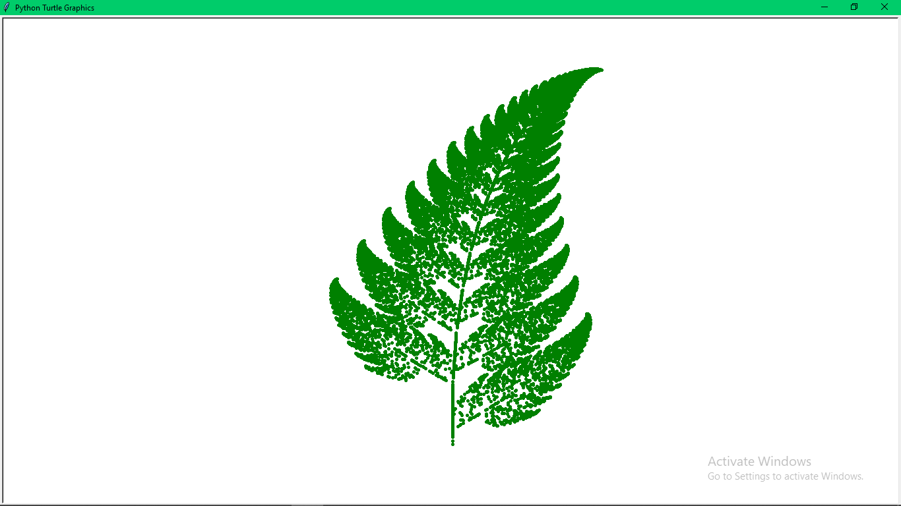
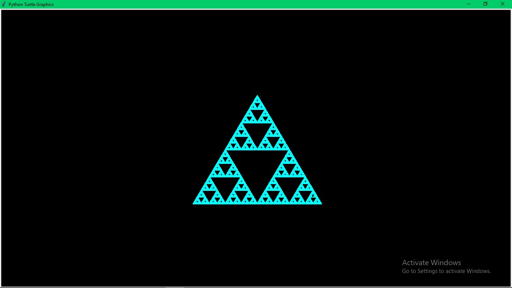

# Some Simulations using python

It's a repository of some geometric simulations that I found very interesting.
## Barnsley fern
---

The fern is one of the basic examples of self-similar sets, i.e. it is a mathematically generated pattern that can be reproducible at any magnification or reduction.

Here it is generated using fractal geometry. More about bernsley fern can be found [here](https://en.wikipedia.org/wiki/Barnsley_fern)

## Sierpiński Gasket
---

Sierpiński's triangle is an example of fractal geometry.
The Sierpinski triangle can be constructed from an equilateral triangle by repeated removal of triangular subsets.

more about Sierpiński's triangle can be found [here](https://en.wikipedia.org/wiki/Sierpi%C5%84ski_triangle)